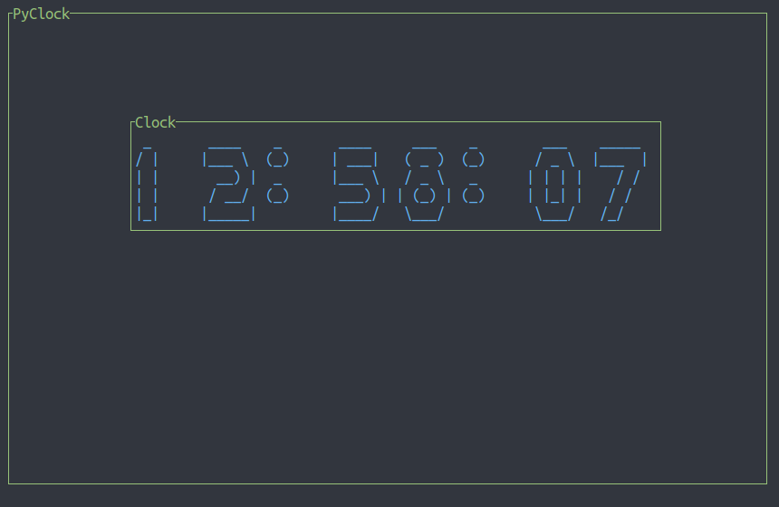
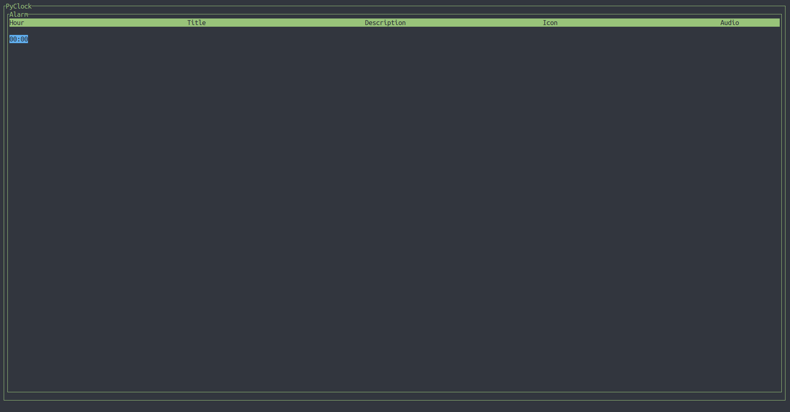

# PyClock
The terminal python clock



## Installation
You can use the installer provided
in the repository which also copies
the files used in the program
```
python Installer.py
```
But if you want you can compile it manually
with pyinstaller
```
python -m PyInstaller PyClock.py
```
And copy the configuration files in the
/.config/ dir of your user
```
cp /files/* $HOME/.config/
```

## Usage
PyClock has four modes

### Clock
For the clock mode there are two flags, none is required
```
PyClock Clock --hour-format {12,24} --add-seconds
```
If no flag is given then the default will be a clock
with an hour hormat of 12 with no seconds
```
PyClock Clock
```

### Alarm
For the alarm mode there is only one flag which isn't required
```
PyClock Alarm --modify-alarms
```

### Timer
For the timer mode there are two required flags
```
PyClock Timer --time-unit {s,m,h} --time-value VAL
```
Arguments can be combined
```
PyClock Timer --time-unit s --time-value 15 --time-unit m --time-value 35
```

### Counter
For the counter mode there is only one flag which isn't required
```
PyClock Counter --countdown VAL
```

## Modifying alarms

To modify or add alarms you need to start the program with the
modify alarms flag on. Alarms have 5 attributes:

* Hour
* Title
* Message
* Icon
* Audio

Hour attribute must be given in "%H:%M" 24 hour format, the default title attribute
will be the program name, the default message attribute will be the hour, the default
icon attribute will be in $HOME/.config/, add the flag "Yes" to enable audio
